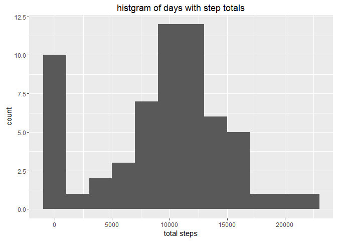
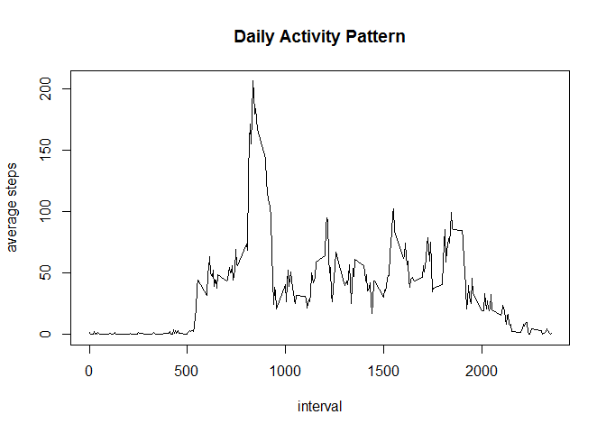
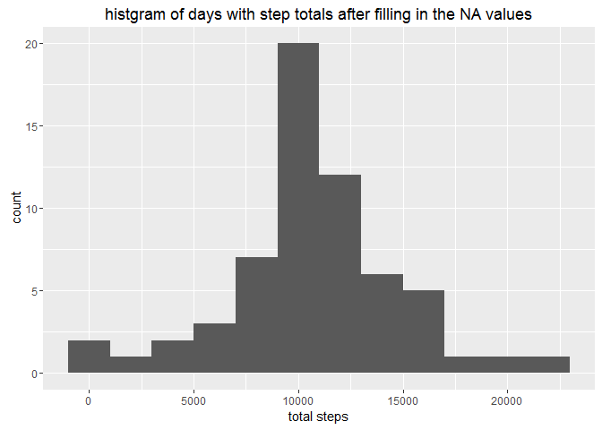

# Reproducible Research: Peer Assessment 1

## Loading and preprocessing the data


```r
## Start with a clean environment
rm(list = ls())

## If the CSV file has not already been unzipped, do it now from the ZIP file provided.
if(!file.exists("activity.csv")) {
    unzip("activity.zip")
}

activity_data = read.csv("activity.csv", stringsAsFactors=FALSE, na.strings = "NA")

# Add columns for hour, minute, and then a combined date/time
activity_data$date   <- as.Date(activity_data$date, format="%Y-%m-%d")
activity_data$hour   <- activity_data$interval %/% 100
activity_data$minute <- activity_data$interval %%  100

activity_data$DateTime <- strptime(paste(activity_data$date, 
                                         activity_data$hour, 
                                         activity_data$minute), format="%Y-%m-%d %H %M")
```


## What is mean total number of steps taken per day?

> 1. Make a histogram of the total number of steps taken each day


```r
## Calculate the average steps taken each day
daily_steps <- aggregate(activity_data$steps, by=list(activity_data$date), sum, na.rm=TRUE, na.action=NULL)
names(daily_steps) <- c("date", "total.steps")

## Plot the total steps taken each day
require(ggplot2)
```

```
## Loading required package: ggplot2
```

```r
p <- ggplot(daily_steps, aes(x=total.steps))
p + geom_histogram(aes(y = ..count..), binwidth=2000)+
    ggtitle("histgram of days with step totals") + 
    xlab("total steps")
```

<!-- -->

> 2. Calculate and report the **mean** and **median** total number of steps taken per day


```r
paste("The mean of steps taken per day is ", round( mean(daily_steps$total.steps, na.rm=TRUE), 1), 
      " and median number is ", median(daily_steps$total.steps, na.rm=TRUE) )
```

```
## [1] "The mean of steps taken per day is  9354.2  and median number is  10395"
```


## What is the average daily activity pattern?


```r
## Calculate the mean number of steps taken by 5-minute interval across days
interval_mean <- aggregate(activity_data$steps, by=list(activity_data$interval), mean,
                           na.rm=TRUE, na.action=NULL)
names(interval_mean) <- c("interval", "mean.steps")
```

> 1. Make a time series plot (i.e. type="l") of the 5-minute interval (x-axis) 
and the average number of steps taken, averaged across all days (y-axis)


```r
plot(interval_mean, type="l", main="Daily Activity Pattern",
     xlab="interval", ylab="average steps")
```

<!-- -->

> 2. Which 5-minute interval, on average across all the days in the dataset, 
contains the maximum number of steps?


```r
interval_mean[which.max(interval_mean$mean.steps),]
```

```
##     interval mean.steps
## 104      835   206.1698
```

The 5-minute interval with the highest average steps is interval 
**835**, 
with **206.1698113** 
steps.

## Imputing missing values
> 1. Calculate and report the total number of missing values in the dataset 
(i.e. the total number of rows with NAs)


```r
sum(is.na(activity_data$steps))
```

```
## [1] 2304
```

> 2. Devise a strategy for filling in all of the missing values in the dataset. 
The strategy does not need to be sophisticated. For example, you could use the 
mean/median for that day, or the mean for that 5-minute interval, etc.


```r
interval_mean_all <- sapply(list(activity_data$interval), function(x) {
    interval_mean[match(x, interval_mean$interval),2]
})
```

Variable with the same rows as the **activity_data** variable, with each row containing the average steps for that particular 5-minute interal.

> 3. Create a new dataset that is equal to the original dataset but with the missing data filled in.


```r
full_data <- activity_data # new dataset
missing_data <- is.na(activity_data$steps) # identify the rows with NA
full_data$steps[missing_data] <- interval_mean_all[missing_data]
```

For each NA row in **steps** variable, replace with the average steps for that 5-minute interval.

> 4. Make a histogram of the total number of steps taken each day and Calculate and report the mean and median total number of steps taken per day. Do these values differ from the estimates from the first part of the assignment? What is the impact of imputing missing data on the estimates of the total daily number of steps?


```r
full_daily_steps <- aggregate(full_data$steps, by=list(full_data$date),
                               sum, na.rm=TRUE, na.action=NULL)
names(full_daily_steps) <- c("date", "total.steps")

## Plot the total steps taken each day
require(ggplot2)
p <- ggplot(full_daily_steps, aes(x=total.steps))
p + geom_histogram(aes(y = ..count..), binwidth=2000)+
    ggtitle("histgram of days with step totals after filling in the NA values") + 
    xlab("total steps")
```

<!-- -->


```r
originalMean <- mean(daily_steps$total.steps, na.rm=TRUE)
newMean <- mean(full_daily_steps$total.steps, na.rm=TRUE)

originalMedian <- median(daily_steps$total.steps, na.rm=TRUE)
newMedian <- median(full_daily_steps$total.steps, na.rm=TRUE)
```
Before imputing values to replace NAs, the mean of steps taken per day was 
**9354.23**, and after it now is 
**10766.19**. The median number was 
**10395**, and now is 
**10766.19**. After 
imputation, the average and median both clearly increased.

## Are there differences in activity patterns between weekdays and weekends?
> 1. Create a new factor variable in the dataset with two levels - "weekday" and "weekend" indicating whether a given date is a weekday or weekend day.


```r
full_data$weekday <- "weekday"
full_data$weekday[weekdays(full_data$date)=="Saturday" | weekdays(full_data$date)=="Sunday"] <- "weekend"
full_data$weekday <- as.factor(full_data$weekday)
```

> 2. Make a panel plot containing a time series plot (i.e. type="l") of the 5-minute interval (x-axis) and the average number of steps taken, averaged across all weekday days or weekend days (y-axis).


```r
require(lattice)
```

```
## Loading required package: lattice
```

```r
interval_mean_full <- aggregate(full_data$steps, by=list(full_data$weekday, full_data$interval), mean, na.rm=TRUE, na.action=NULL)
names(interval_mean_full) <- c("weekday", "interval", "mean.steps")
xyplot(interval_mean_full$mean.steps ~ interval_mean_full$interval | interval_mean_full$weekday, layout=c(1,2), type="l", xlab="Interval", ylab="Number of steps")
```

<!-- -->
